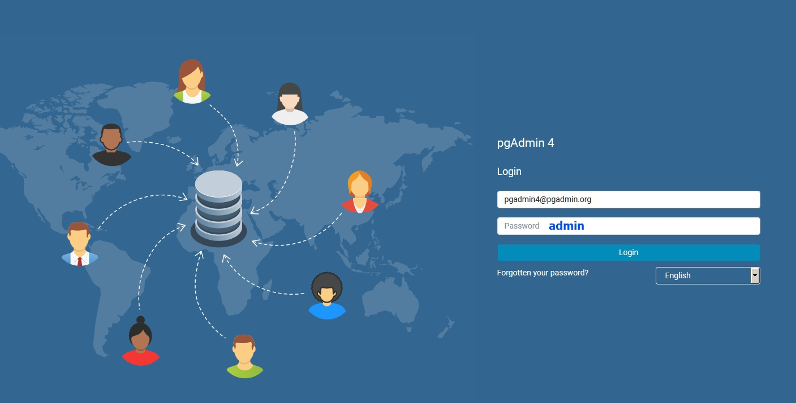

# docker-compose.yml

รายการ docker container มี 2 รายการแยกกันดังนี้

* odoo : 12.0
* postgres : 11.0

การทำงานของแต่ละ container เสมือนมี server แยกทำงานกัน container ละตัว

ใช้ประกอบการอบรม การพัฒนาโปรแกรมด้วย Odoo ERP ของชุมชน Thai OCA


# Docker Server

ทางเลือกในการใช้ Docker มีหลายวิธี ท่านอาจะติดตั้ง Docker ใน Windows 

https://docs.docker.com/docker-for-windows/install/

หรือถ้าต้องการความเหมือนจริง สามารถติดตั้งโปรแกรม Virtualbox แล้วลง Linux Ubuntu ใน Virtualbox 

โดย Download ไฟล์ ISO Image มาจำลองเป็นแผ่นติดตั้งใน Virtualbox ได้

https://www.virtualbox.org/wiki/Downloads

https://ubuntu.com/download/server


การตั้งค่าการ์ดแลนใน vitualbox อาจจะใช้ bridge mode ตัวเดียว 

จำลองเป็นการ์ดของอีกเครื่องที่อยู่ในวงแลนเดียวกันในสำนักงาน 

ซึ่งเครื่องอื่นสามารถเข้ามาชมเว็บ odoo ของเราได้


การเชื่อมต่อระบบเข้า server สามารถใช้โปรแกรม putty และ winscp

https://www.chiark.greenend.org.uk/~sgtatham/putty/latest.html

https://winscp.net/eng/download.php


>ที่อยากแนะนำที่สุดคือ ลองลง ubuntu desktop ในเครื่องเลยดีกว่า มันไม่ได้เลวร้ายอย่างที่คิด
>แล้วเอา windows ไปลงใน virtualbox แทน


# Usage

เครื่องที่จะใช้งานต้องติดตั้ง docker และ docker-compose ให้เรียบร้อย ถ้าเป็น Linux ได้จะดีมาก

แหล่งศึกษาวิธีการติดตั้ง docker ใน linux

https://linuxize.com/post/how-to-install-and-use-docker-on-ubuntu-18-04/

การติดตั้ง docker-compose

https://linuxize.com/post/how-to-install-and-use-docker-compose-on-ubuntu-18-04/


```
git clone https://github.com/songwutk/odoo-12-docker-compose.git

cd odoo-12-docker-compose
```

Change the folder permission to make sure that the container is able to access the directory:

กำหนดให้โฟลเดอร์ addons และ etc เขียนได้ทุกระดับ user
```
$ sudo chmod -R 777 addons
$ sudo chmod -R 777 etc
```

Start the container:
เริ่มขึ้นระบบ
```
$ docker-compose up -d
```

* Then open `localhost:8069` to access Odoo 12.0. If you want to start the server with a different port, change **8069** to another value:

การเข้าเว็บให้ชี้ไปที่ port 8069 เช่น localhost:8069 หรือ http://(ip):8069 เป็นต้น
```
# ข้อความใน docker-compose.yml
# -"ด้านนอกฝั่ง user":"ด้านใน docker container"
ports:
 - "8069:8069"
```

# ตั้งเวลาท้องถิ่นใน docker container Odoo เป็นประเทศไทย
```
docker exec -t --user root  odoo  rm -f /etc/localtime

docker exec -t --user root  odoo  ln -s /usr/share/zoneinfo/Asia/Bangkok /etc/localtime
```

# การติดตามการทำงานของ Odoo

* Log file is printed @ **etc/odoo-server.log**
 
```
 tail log/odoo-server.log  -f
```

```
 tail log/pgsql/pgsql.csv  -f
```

** คำเตือน : ระบบเปิด log ของ odoo แบบ 100% โปรดระวังขนาดไฟล์ใน log/odoo-server.log และ log/pgsql/pgsql.csv

# Odoo configuration

To change Odoo configuration, edit file: **etc/odoo.conf**.

การปิด log อันมหาศาลจาก odoo : etc/odoo.conf

```
; log_level = info

```

การปิด log อันมหาศาลจาก pgsql : etc/pgsql/postgresql.conf
```
; log_destination = 'csvlog'              # Valid values are combinations of
; logging_collector = on          # Enable capturing of stderr and csvlog
```
# การเชื่อมต่อกับตัวจัดการ Database
 
 localhost:5050 หรือ http://(ip):5050 
 
 ท่านจะพบกับ pgadmin 
 
 

ใส่ username password ดังรูป

 

ชื่อ hostname pgsql จะเป็นชื่อใน docker container ซึ่งระบบจะมองเห็นกันเอง 

หากต้องการเชื่อมต่อด้วย Navicat สามารถใช้ username odoo / password odoo / ip server


# Custom addons

ทดลองสร้าง Module ขึ้นมาใหม่ในชื่อ phone book 

The **addons** folder contains custom addons. Just put your custom addons if you have any.

Create new module "phonebook" by command

ใช้คำสั่ง docker ดังนี้

```
docker exec -t odoo odoo scaffold /mnt/extra-addons/phonebook
```

Basic module stater is in addons host folder

ระบบจะมีการสร้างไฟล์พื้นฐานของ Module ไว้ที่โฟลเดอร์ addons

```
# ข้อความใน docker-compose.yml

#  เปิดประตูมิติเชื่อมหากัน
#  folder เครื่องของเรา : folder ที่อยู่ใน docker container
    volumes:
      - ./addons:/mnt/extra-addons
```

# ขอให้สนุกกับการเขียนโปรแกรม


https://www.odoo.com/documentation/12.0/howtos/backend.html


# Odoo 12 screenshots


